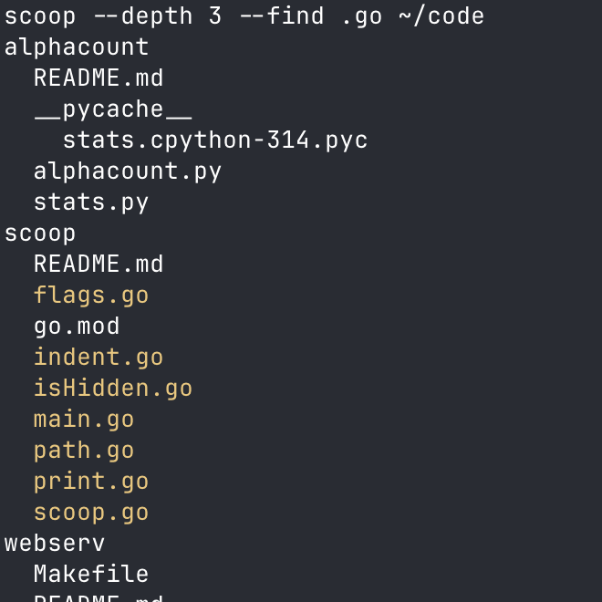

# scoop


Command-line tool that displays the directory structure using indentation to show hierarchy.



## How to run

*Requires [Go](https://golang.org/dl/) 1.22+*

Clone this repository:

```bash
git clone https://github.com/s-gas/scoop.git
```

Change to the project directory:

```bash
cd scoop
```

Create the executable:

```bash
go build -o scoop .
```

In order to run it from other directories, move the binary to a directory included in your PATH:

```bash
sudo mv scoop /usr/local/bin
```

Run:

```bash
scoop [flags] [path]
```

### Available flags:

- Maximum depth (default 4)
```bash
--depth int
```

- Show hidden files
```bash      
--hidden
```

- Highlight files containing given string
```bash
--find string
```
